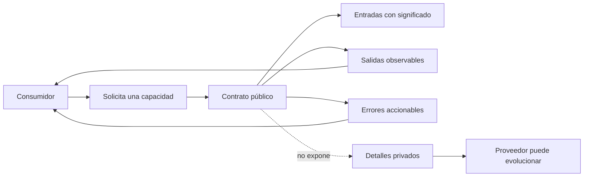

# Contratos y límites de una API

**Estado:** draft

## Introducción

Una API existe en la frontera entre un sistema y sus consumidores. No es solo
una ruta HTTP, una operación GraphQL o un método generado por gRPC: es una
promesa que otra persona, servicio o interfaz usará para tomar decisiones.

Esa promesa necesita ser precisa sin convertir los detalles internos del
sistema en deuda pública. Este capítulo fija el vocabulario y los límites que
usará el resto del curso antes de hablar de estilos, herramientas o código.

## Concepto

Un contrato de API es el acuerdo observable entre quien ofrece una capacidad y
quien la consume. Describe qué se puede pedir, qué respuesta se recibe, qué
errores son significativos y qué reglas permanecen estables durante la vida
útil de esa integración.

Un contrato útil no enumera cómo está construido el proveedor. Enumera lo que
el consumidor puede observar y en qué condiciones puede confiar. Por ejemplo,
una API de pedidos puede prometer que un pedido confirmado incluye un
identificador estable y un estado válido. No necesita prometer la tabla, cola,
servicio o estructura de Rust que el proveedor usa para conseguirlo.

Por eso un contrato tiene cuatro partes inseparables:

- **capacidad:** la intención que el consumidor puede solicitar;
- **forma:** datos, nombres y estructuras que cruzan la frontera;
- **semántica:** significado de una respuesta, un error o una transición;
- **evolución:** cambios que el consumidor puede absorber sin romperse.

## Problema

Sin un contrato explícito, los consumidores terminan deduciendo reglas desde
ejemplos accidentales. Un campo que "siempre venía", un orden que "parecía
estable" o un error que "nunca ocurría" se convierten en dependencias reales
sin que nadie las haya aceptado como públicas.

El daño aparece cuando el proveedor cambia internamente: una optimización,
una migración o una nueva regla de negocio rompe una interfaz que jamás fue
nombrada. El cambio puede ser correcto dentro del servicio y, al mismo tiempo,
ser una regresión para sus consumidores.

El problema no se resuelve publicando cada detalle. Una API que expone
persistencia, modelos internos o decisiones transitorias queda rígida. El
objetivo es seleccionar una frontera pequeña, comprensible y estable: lo
suficiente para integrar con confianza y no más de lo que el proveedor puede
sostener.

## Alternativas

La primera alternativa es diseñar desde la implementación. Parte de las
estructuras existentes y las serializa casi directamente. Es rápida al inicio,
pero hace pública la forma actual del sistema y convierte cada refactor en un
riesgo de compatibilidad.

La segunda es diseñar solo desde la conveniencia del primer consumidor. Puede
producir una integración agradable para un caso concreto, pero suele mezclar
necesidades de pantalla, permisos temporales y supuestos que otros
consumidores no comparten.

La tercera es declarar contratos abstractos sin ejemplos ni reglas de error.
Evita algunos detalles internos, pero deja ambigüedad: dos equipos pueden leer
la misma frase y construir integraciones incompatibles.

Este curso adopta una cuarta alternativa: diseñar la capacidad desde el
consumidor, describir sus resultados observables y poner límites explícitos a
lo que no se promete. La implementación se elegirá después y podrá cambiar
sin reescribir el acuerdo público.

## Qué pertenece al contrato

Un contrato debe explicar aquello que un consumidor necesita para integrar y
operar de forma correcta:

- qué capacidad representa cada operación;
- qué datos acepta y cuáles valida;
- qué datos devuelve y qué significan;
- qué errores puede distinguir y qué acción razonable permiten tomar;
- qué orden, identidad, paginación, concurrencia o permisos son observables;
- qué cambios preservan compatibilidad y cuáles requieren una transición.

La frase guía es sencilla: si un consumidor razonable debe depender de una
regla para usar la API correctamente, esa regla debe aparecer en el contrato.

## Qué debe permanecer interno

No todo comportamiento del proveedor merece convertirse en una promesa. Deben
permanecer internos, salvo que se declaren de forma deliberada, los nombres de
tablas, la topología de servicios, los algoritmos de selección, el orden de
ejecución de procesos auxiliares y la representación exacta de modelos de
dominio.

También debe tratarse con cuidado cualquier dato que sea cómodo para un
consumidor actual pero difícil de sostener a futuro. Publicar una conveniencia
sin nombrar su semántica suele crear una dependencia silenciosa.

## Invariantes

- Cada operación expresa una capacidad, no un detalle de almacenamiento.
- Cada campo público tiene significado, reglas de presencia y límites claros.
- Un consumidor no necesita conocer la implementación para usar el contrato.
- Un error público permite distinguir una situación accionable, no solo que
  "algo salió mal".
- Las reglas que afectan compatibilidad se declaran antes de cambiar la API.
- Lo que no se promete explícitamente no debe asumirse estable.
- La claridad del contrato tiene prioridad sobre la cantidad de datos expuestos.

## Preguntas de diseño

Antes de implementar una API, conviene poder responder estas preguntas:

1. ¿Qué tarea real resuelve el consumidor al invocar esta operación?
2. ¿Qué necesita saber para distinguir éxito, error recuperable y error final?
3. ¿Qué parte de la respuesta es una promesa y qué parte es incidental?
4. ¿Qué cambio interno debería ser posible sin obligar a modificar al
   consumidor?
5. ¿Qué decisión quedaría ambigua si solo existiera un ejemplo feliz?

Estas preguntas no sustituyen una especificación. Evitan que la especificación
empiece demasiado tarde, cuando los consumidores ya convirtieron supuestos en
dependencias.

## Del diseño al contrato ejecutable

El contrato puede escribirse antes de elegir protocolo o framework porque su
responsabilidad no es transportar datos; es nombrar la frontera. El siguiente
diagrama separa aquello que el consumidor necesita conocer de aquello que el
proveedor conserva como libertad de implementación.



El archivo fuente está en
[`diagrams/01-contratos-y-limites.mmd`](../diagrams/01-contratos-y-limites.mmd).
El diagrama no afirma que todos los contratos tengan la misma forma. Señala un
límite: las entradas, salidas y errores se explican al consumidor; la
persistencia y la topología no se prometen por accidente.

## Implementación

El módulo [`contracts`](../src/contracts.rs) expresa este vocabulario sin
introducir un servidor ni dependencias externas. `ApiContract` exige una
capacidad y al menos una salida observable. `PublicField` obliga a declarar
nombre, significado y presencia. `ActionableError` evita tratar todos los
errores como texto opaco y `PrivateDetail` documenta qué permanece fuera de la
promesa.

El modelo también rechaza nombres repetidos entre entrada y salida. No es una
regla universal para toda API real; es una restricción deliberada del primer
modelo para que el lector note cuándo la misma palabra intenta significar dos
cosas distintas en la frontera pública.

## Ejemplo: consultar un pedido

Un consumidor necesita consultar el estado de un pedido. Lo importante no es
si el proveedor usa una base de datos, una caché o varios servicios. Lo que
forma parte del contrato es qué identificador recibe, qué estado devuelve y
qué puede hacer el consumidor si el pedido no existe.

```rust
use rust_api_design::contracts::{
    ActionableError, ApiContract, Presence, PrivateDetail, PublicField,
};

let contract = ApiContract::new(
    "consultar un pedido",
    vec![PublicField::new(
        "pedido_id",
        "identificador estable del pedido",
        Presence::Required,
    )?],
    vec![PublicField::new(
        "estado",
        "estado actual que el consumidor puede mostrar",
        Presence::Required,
    )?],
    vec![ActionableError::new(
        "pedido_no_encontrado",
        "corregir el identificador o dejar de consultar",
    )?],
    vec![PrivateDetail::new(
        "la estrategia de búsqueda y almacenamiento del pedido",
    )?],
)?;

assert_eq!(contract.capability(), "consultar un pedido");
# Ok::<(), rust_api_design::contracts::ContractError>(())
```

El ejemplo completo y ejecutable está en
[`examples/01-contratos-publicos.rs`](../examples/01-contratos-publicos.rs).
El consumidor puede depender de `pedido_id`, `estado` y
`pedido_no_encontrado`. No debe depender de cómo se busca el pedido. Ese
límite permite que el proveedor mejore su implementación sin renegociar la
integración.

## Complejidad

El modelo no persigue complejidad algorítmica. Su costo relevante es cognitivo:
cada campo o error público añade una promesa que habrá que explicar,
compatibilizar y sostener. Un contrato más grande no es automáticamente más
útil; suele ser más difícil de evolucionar.

Por eso el capítulo parte de una capacidad y un resultado observable. La
complejidad adicional solo se justifica cuando responde a una necesidad real
del consumidor y puede expresarse con semántica clara.

## Pruebas

El módulo protege tres propiedades del ejemplo:

- un contrato válido conserva una promesa observable y un límite privado;
- un contrato sin salida se rechaza porque no explica qué puede esperar el
  consumidor;
- un nombre repetido en la frontera pública se rechaza para evitar ambigüedad.

Además, el doctest de `ApiContract` y el ejemplo ejecutable se compilan como
parte de la verificación del crate. La prueba no certifica que toda API esté
bien diseñada; confirma que las invariantes didácticas de este modelo siguen
vigentes.

## Siguiente paso

Los siguientes capítulos aplicarán esta frontera a semántica HTTP, errores,
paginación, compatibilidad y especificaciones ejecutables. Antes de elegir un
estilo de API, cada decisión deberá conservar la pregunta central: ¿qué puede
depender de esto un consumidor sin conocer la implementación?

## Decisiones registradas

- El curso trata el contrato como una promesa observable, no como la
  serialización de un modelo interno.
- Cada capítulo parte de capacidad, semántica y límites antes de elegir una
  tecnología de API.
- El contenido permanece en `draft`; no está revisado ni publicado.
