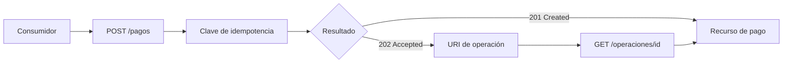

# REST y semántica HTTP

**Estado:** draft

## Introducción

HTTP no es una tubería neutral para mover JSON. Sus métodos, códigos de estado,
cabeceras y reglas de caché forman parte del contrato que un consumidor usa
para decidir si puede reintentar, mostrar un resultado, corregir una entrada o
esperar una transición.

REST aprovecha esa semántica para modelar capacidades alrededor de recursos.
No convierte cualquier URL en REST por usar `GET` y `POST`: exige que los
nombres, métodos y respuestas conserven significado observable para quien
integra.

## Concepto

Un recurso es una representación identificable de algo que importa al dominio:
un pedido, una factura, una colección de productos o una operación en curso.
La URI identifica el recurso o la colección; el método HTTP expresa la clase
de interacción; la respuesta comunica el resultado dentro del protocolo.

El diseño nace de la capacidad del consumidor, no de la estructura de una
tabla. Por ejemplo, `GET /pedidos/42` expresa la consulta de un pedido. El
consumidor puede interpretar `200`, `404` y las cabeceras de caché sin conocer
el servicio, repositorio o consulta que produjo la respuesta.

Las piezas mínimas de esta semántica son:

- **recurso:** entidad o colección con significado de dominio;
- **método:** intención protocolaria, como leer, crear o reemplazar;
- **estado:** resultado observable de la interacción;
- **representación:** datos y metadatos que cruzan la frontera;
- **propiedad de reintento:** qué ocurre si una solicitud llega más de una vez.

## Problema

Cuando HTTP se trata como una envoltura de RPC, aparecen rutas con verbos
internos, métodos que cambian estado al leer y respuestas que siempre devuelven
`200` aunque el consumidor no pueda actuar correctamente. El costo no es solo
estético: clientes, proxies, cachés, herramientas de observabilidad y personas
que integran pierden señales que el protocolo ya ofrece.

El caso más delicado ocurre ante fallas parciales. Si el cliente no sabe si una
solicitud llegó al servidor, necesita entender si puede reintentarse. Sin una
semántica clara, puede duplicar un pago, crear dos pedidos o abandonar una
operación que sí se completó.

La solución tampoco es memorizar una tabla de códigos. Un `404` correcto con
un recurso mal elegido sigue siendo un contrato débil. El problema se resuelve
cuando recurso, método, estado y reintento cuentan la misma historia.

## Alternativas

La primera alternativa es ignorar HTTP y exponer acciones como
`POST /crearPedido` o `POST /cancelarPedido`. Puede ser directa para el equipo
que conoce la implementación, pero obliga al consumidor a aprender un
vocabulario paralelo y deja ambiguas propiedades como seguridad, caché e
idempotencia.

La segunda es aplicar reglas REST de forma mecánica. Por ejemplo, usar `PUT`
siempre que exista un identificador o devolver `204` para cualquier éxito. Esto
parece uniforme, pero puede ocultar la diferencia entre crear, reemplazar,
aceptar trabajo asíncrono o devolver una representación útil.

La tercera es elegir el estilo por la operación real: nombrar el recurso,
seleccionar el método por su semántica y devolver un estado que permita al
consumidor decidir qué hacer. Este curso adopta esa alternativa porque preserva
la capacidad de evolucionar y aprovechar el protocolo sin fingir que HTTP
resuelve todas las necesidades de dominio.

## Semántica de métodos

`GET` recupera una representación y debe ser seguro: observarlo no debe causar
un cambio de negocio. `POST` solicita procesamiento bajo la colección o un
recurso; puede crear una entidad, iniciar una operación o delegar una acción
que no encaja como reemplazo. `PUT` coloca una representación completa en una
URI conocida y debe ser idempotente. `PATCH` describe una modificación parcial
y necesita definir con precisión qué ocurre al repetirla. `DELETE` solicita la
eliminación o retirada de una representación y también debe definir la
semántica de repeticiones.

Idempotencia no significa que la primera y segunda respuesta sean idénticas.
Significa que repetir la misma solicitud con la misma intención deja el
recurso en un estado equivalente. Esta propiedad permite que un consumidor
reintente después de una falla de red sin convertir la incertidumbre en un
efecto duplicado.

## Semántica de estados

Los códigos de estado no reemplazan un cuerpo de error útil, pero dan la
primera clasificación protocolaria. `200` representa una respuesta exitosa
con contenido; `201` comunica creación e idealmente identifica el recurso;
`202` acepta trabajo que todavía no terminó; `204` confirma éxito sin cuerpo.

En el lado de los errores, `400` señala una solicitud que no puede
interpretarse, `401` una falta de autenticación, `403` una autorización
insuficiente, `404` un recurso no disponible para ese contrato, `409` un
conflicto con el estado actual y `422` una solicitud entendida pero inválida
según reglas de dominio. La elección exige explicar qué puede hacer el
consumidor después, no solo clasificar la falla.

## Invariantes

- Una URI nombra un recurso o una colección, no una función interna.
- Un método conserva su semántica de seguridad e idempotencia declarada.
- Un estado HTTP permite la primera decisión del consumidor sobre el resultado.
- Un error de dominio incluye información accionable además del código HTTP.
- Un reintento no debe duplicar un efecto cuando la operación se declara
  idempotente.
- Una respuesta asíncrona declara cómo observar el resultado posterior.
- Caché, concurrencia y permisos se vuelven parte del contrato cuando afectan
  el comportamiento observable.

## Preguntas de diseño

1. ¿Qué recurso necesita observar o modificar el consumidor?
2. ¿El método elegido expresa lectura, creación, reemplazo o modificación
   parcial de manera honesta?
3. ¿Puede el consumidor reintentar después de una falla de red? ¿Por qué?
4. ¿Qué estado y qué cuerpo le permiten distinguir una corrección de una
   espera o un abandono?
5. ¿Qué parte de la representación es estable y qué parte puede evolucionar?

## Del recurso a una respuesta útil

El consumidor no necesita conocer la implementación para seguir el flujo de
una creación idempotente. Necesita saber qué recurso solicita, qué significa
el resultado y cómo actuar si el trabajo continúa fuera de la respuesta.



El archivo fuente vive en
[`diagrams/02-rest-y-http.mmd`](../diagrams/02-rest-y-http.mmd). La clave no
convierte por sí sola cualquier operación en segura: es una promesa adicional
que el proveedor debe sostener al asociarla con la misma intención del cliente.

## Implementación

El módulo [`http`](../src/http.rs) no implementa handlers. Modela lo que un
handler debe poder explicar: `HttpMethod` conserva seguridad e idempotencia,
`HttpStatus` representa el resultado protocolario, `RetryPolicy` hace visible
la regla de repetición y `FollowUpResource` obliga a dar una URI cuando se usa
`202 Accepted`.

El modelo rechaza un `GET` que comunica creación, un reintento de `POST` solo
por semántica de método y una operación asíncrona sin seguimiento público. Son
restricciones didácticas: su propósito es hacer que una contradicción se vea
antes de que aparezca detrás de un framework.

## Ejemplo: registrar un pago sin duplicarlo

Una aplicación puede perder la conexión después de enviar un pago. Como no
sabe si el servidor lo procesó, necesita una política que haga seguro repetir
la intención. En este caso, `POST` comunica creación y la clave de
idempotencia sostiene el reintento.

```rust
use rust_api_design::http::{HttpInteraction, HttpMethod, HttpStatus, RetryPolicy};

let payment = HttpInteraction::new(
    HttpMethod::Post,
    HttpStatus::Created,
    RetryPolicy::IdempotencyKey,
    None,
)?;

assert_eq!(payment.status().code(), 201);
# Ok::<(), rust_api_design::http::HttpDesignError>(())
```

Para trabajo que no termina de inmediato, `202 Accepted` debe incluir una URI
de seguimiento. El ejemplo completo y ejecutable está en
[`examples/02-rest-y-http.rs`](../examples/02-rest-y-http.rs).

## Pruebas

Las pruebas del módulo verifican una creación idempotente con `POST`, rechazan
un `GET` que pretende crear, impiden declarar `POST` idempotente solo por el
método y exigen seguimiento para una respuesta asíncrona. El doctest compila
la forma mínima de una creación con `201`.

Estas pruebas no certifican que una API sea REST. Protegen señales del
contrato que un consumidor necesita para decidir si puede leer, reintentar o
esperar.

## Práctica

Los ejercicios del capítulo están en
[`docs/ejercicios/02-rest-y-http.md`](ejercicios/02-rest-y-http.md). La
solución ejecutable vive en
[`examples/soluciones/02-rest-y-http.rs`](../examples/soluciones/02-rest-y-http.rs).
Primero justifica la interacción en términos de consumidor y después compara
tu decisión con la solución.

## Benchmark

La decisión de benchmark está registrada en
[`benches/02-rest-y-http.md`](../benches/02-rest-y-http.md). El modelo no
representa un handler ni una carga de red, así que medir su creación no
respondería una pregunta de rendimiento útil.

## Siguiente paso

El siguiente capítulo trabaja la experiencia del consumidor: errores,
validación y paginación. Allí, los estados HTTP se complementarán con cuerpos
de error consistentes y límites explícitos para recorrer colecciones.

## Decisiones registradas

- REST se enseña como semántica de recursos sobre HTTP, no como una convención
  de rutas con JSON.
- La idempotencia se explica desde el efecto observable de reintentos.
- El capítulo permanece en `draft`; no está revisado ni publicado.
