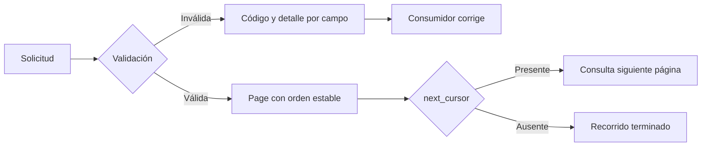

# Errores, validación y paginación

**Estado:** draft

## Introducción

Una API útil no solo responde cuando todo sale bien. También explica qué parte
de una solicitud debe corregirse, qué regla impidió procesarla y cómo recorrer
una colección sin depender de que sus datos permanezcan inmóviles. Esa
experiencia forma parte del contrato, no es un detalle decorativo del cuerpo
JSON.

Este capítulo trata errores, validación y paginación como tres formas de
reducir incertidumbre para el consumidor. Las tres deben ser predecibles,
accionables y estables frente a cambios internos del proveedor.

## Concepto

Un error accionable identifica la categoría de falla, los datos afectados y la
acción razonable que puede tomar el consumidor. No necesita revelar una traza,
una consulta o una excepción interna. Necesita permitir que una interfaz
muestre una corrección, que un cliente automatizado decida reintentar o que un
operador investigue con una referencia segura.

La validación es la aplicación explícita de reglas sobre una solicitud antes de
producir un efecto. Una regla puede referirse a forma, rango, presencia,
permisos o estado de dominio. El consumidor debe distinguir una solicitud que
no se entiende de una solicitud entendida pero inválida según una regla.

La paginación divide una colección potencialmente grande en porciones que un
consumidor puede recorrer. Un cursor no es un desplazamiento interno que se
filtra al exterior: es una continuación opaca con reglas de orden, límite y
consistencia que el contrato debe declarar.

## Problema

Una respuesta como `{"error":"algo salió mal"}` obliga al consumidor a
interpretar texto, adivinar el campo afectado o tratar todos los fallos como
transitorios. Eso crea interfaces frágiles y hace imposible construir una
experiencia clara sin duplicar reglas del servidor.

La validación también se vuelve confusa cuando mezcla errores de sintaxis,
reglas de negocio y fallas internas bajo el mismo estado o formato. El cliente
no sabe si corregir, reintentar o escalar. El proveedor tampoco puede cambiar
el mensaje libre sin romper automatizaciones silenciosas.

En colecciones, usar solo `offset` y `limit` parece simple hasta que llegan
inserciones, eliminaciones o órdenes no deterministas. El consumidor puede ver
duplicados, saltos o resultados que cambian entre páginas. El problema no es
elegir cursor por moda, sino declarar qué recorrido puede confiar el cliente.

## Alternativas

La primera alternativa es devolver mensajes humanos sin código estable. Es
rápida de implementar, pero no sirve para automatizar decisiones ni localizar
una corrección con precisión.

La segunda es usar una lista de errores de validación sin semántica común. Da
más datos, pero cada endpoint termina inventando nombres, formatos y acciones
distintas.

La tercera es paginar con offsets sin declarar orden ni consistencia. Puede
ser adecuada para reportes estáticos pequeños, pero se vuelve ambigua en una
colección que cambia mientras se recorre.

Este curso adopta códigos estables con detalles por campo, reglas de validación
explícitas y continuaciones opacas. No prohíbe `offset`; exige justificarlo
desde la consistencia, tamaño y experiencia que necesita el consumidor.

## Errores como contrato

Un cuerpo de error mínimo debe dar al consumidor un código estable, un mensaje
apto para personas y detalles opcionales que localicen el problema. El código
es la clave para automatizar; el mensaje explica contexto; los detalles evitan
que el cliente tenga que volver a implementar validaciones del proveedor.

Los detalles deben identificar el campo o parte de la solicitud cuando eso sea
seguro y útil. No deben exponer secretos, reglas internas sensibles ni una
traza. Una referencia de correlación puede ayudar a soporte sin hacer pública
la arquitectura del servidor.

## Validación antes del efecto

Validar antes de producir un efecto permite que el consumidor corrija una
solicitud sin preguntarse si algo se aplicó parcialmente. Cuando una operación
sí admite efectos parciales o asíncronos, el contrato debe declararlo y ofrecer
una forma de observar el resultado, como se estudió con `202 Accepted`.

La validación de formato responde si la solicitud puede interpretarse. La
validación de dominio responde si esa solicitud tiene sentido en el estado
actual del sistema. Ambas pueden necesitar códigos HTTP distintos, pero deben
compartir una estructura que el consumidor pueda recorrer de manera uniforme.

## Paginación y continuidad

Una página necesita elementos, un límite solicitado o aplicado y una
continuación que el consumidor pueda usar sin comprender cómo se almacenan los
datos. Para que un cursor sea seguro, el contrato define un orden estable y
qué ocurre cuando la colección cambia durante el recorrido.

Un cursor puede codificar una posición, una marca de tiempo o una clave de
orden. El consumidor no debe interpretarlo ni construirlo. Si se invalida por
caducidad, permisos o cambio de consulta, la API debe devolver un error
accionable en lugar de repetir o saltar elementos en silencio.

## Invariantes

- Cada error expone un código estable y una acción comprensible.
- Los detalles de validación localizan una corrección sin filtrar secretos.
- La validación distingue una entrada mal formada de una regla de dominio.
- Una solicitud rechazada antes del efecto no deja cambios parcialmente
  aplicados.
- Una página declara un orden estable antes de entregar un cursor.
- Un cursor es opaco para el consumidor y específico de su consulta.
- Un límite máximo protege al proveedor sin convertir la respuesta en una
  sorpresa silenciosa.

## Preguntas de diseño

1. ¿Qué debe poder hacer un consumidor distinto después de cada código de
   error?
2. ¿Qué campo o regla conviene revelar para corregir una solicitud?
3. ¿Qué información interna sería peligrosa incluir en un detalle de error?
4. ¿Cuál es el orden estable que sostiene una continuación de página?
5. ¿Qué ocurre cuando un cursor ya no es válido para la consulta original?

## Del error a la siguiente decisión

La experiencia del consumidor se vuelve predecible cuando cada respuesta le
permite elegir una acción: corregir una entrada, detener un flujo o continuar
una colección con el mismo orden declarado.



El archivo fuente está en
[`diagrams/03-experiencia-del-consumidor.mmd`](../diagrams/03-experiencia-del-consumidor.mmd).
Un cursor no explica la consulta ni el almacenamiento: solo permite continuar
la misma intención bajo las reglas que el proveedor declaró.

## Implementación

El módulo [`consumer`](../src/consumer.rs) representa un `ApiError` con código
estable, mensaje y `ValidationDetail` seguro. También representa `Page<T>` con
elementos, límite, `StableOrder` y `Cursor` opcional. El constructor rechaza un
límite cero o una página que contiene más elementos de los prometidos.

El modelo no serializa JSON ni firma cursores. Mantiene el foco en la promesa:
un consumidor puede localizar un error y recorrer una página sin interpretar
detalles internos.

## Ejemplo: corregir y continuar

```rust
use rust_api_design::consumer::{ApiError, Cursor, Page, StableOrder, ValidationDetail};

let error = ApiError::new(
    "importe_invalido",
    "El importe debe ser positivo.",
    vec![ValidationDetail::new("importe", "mayor que cero")?],
)?;
assert_eq!(error.details()[0].field(), "importe");

let page = Page::new(
    vec!["pago-1", "pago-2"],
    2,
    StableOrder::new("created_at asc, id asc")?,
    Some(Cursor::new("continuacion-opaca")?),
)?;
assert_eq!(page.next_cursor().unwrap().as_str(), "continuacion-opaca");
# Ok::<(), rust_api_design::consumer::ConsumerError>(())
```

El ejemplo ejecutable está en
[`examples/03-experiencia-del-consumidor.rs`](../examples/03-experiencia-del-consumidor.rs).
El código de error permite una corrección específica; el cursor permite pedir
la siguiente página sin exponer el desplazamiento o la consulta del proveedor.

## Pruebas

Las pruebas verifican que un error conserve código y detalle de campo, que una
página mantenga orden y cursor, y que no pueda prometer un límite menor que sus
elementos. El modelo no prueba consistencia de una base de datos; protege la
estructura que un consumidor usa para reaccionar.

## Práctica

Los ejercicios están en
[`docs/ejercicios/03-experiencia-del-consumidor.md`](ejercicios/03-experiencia-del-consumidor.md)
y la solución ejecutable en
[`examples/soluciones/03-experiencia-del-consumidor.rs`](../examples/soluciones/03-experiencia-del-consumidor.rs).
Primero explica la acción que habilita cada error y la estabilidad del orden
antes de comparar tu solución.

## Benchmark

La decisión de benchmark vive en
[`benches/03-experiencia-del-consumidor.md`](../benches/03-experiencia-del-consumidor.md).
El modelo todavía no procesa carga real ni serializa respuestas, por lo que una
medición sintética no fundamentaría una decisión de diseño.

## Siguiente paso

El siguiente bloque añade ejercicios, solución y decisión de benchmark. Después
el curso abordará la evolución de APIs y las compatibilidades que estos
contratos deben sostener con el tiempo.

## Decisiones registradas

- Los errores se enseñan como datos de decisión para consumidores, no como
  mensajes libres del servidor.
- La paginación se enseña desde la continuidad y el orden, no desde un offset
  elegido por costumbre.
- El capítulo permanece en `draft`; no está revisado ni publicado.
