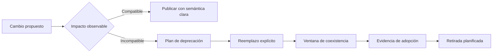

# Versionado y compatibilidad

**Estado:** draft

## Introducción

Una API empieza a romperse mucho antes de que un endpoint desaparezca. Basta
con cambiar el significado de un campo, hacer obligatorio un valor antes
opcional, modificar el orden de una colección o reutilizar un código de error.
La compatibilidad es la disciplina de reconocer esas dependencias antes de que
se conviertan en incidentes de integración.

Este capítulo estudia cómo evolucionar contratos con cambios explícitos,
deprecaciones observables y migraciones que den tiempo real a los consumidores.

## Concepto

Un cambio compatible permite que un consumidor que cumple el contrato anterior
siga funcionando correctamente sin modificar su integración. Un cambio
incompatible exige una transición: versión nueva, campo alternativo, ventana de
deprecación o migración coordinada.

La compatibilidad no se determina solo por la forma del JSON. También incluye
semántica, presencia, orden, errores, autorización, límites y comportamiento
de reintento. Agregar un campo opcional suele ser compatible; cambiar el
significado de uno existente no lo es aunque conserve el mismo nombre y tipo.

## Problema

Cuando un proveedor trata la API como una extensión de su código interno,
cualquier refactor parece inocente. Para un consumidor, sin embargo, la
respuesta anterior es una promesa ya integrada en pantallas, procesos y
automatizaciones. El proveedor puede desplegar una mejora y al mismo tiempo
romper decisiones que no conoce.

Versionar cada cambio tampoco resuelve el problema. Crear `/v2`, `/v3` y `/v4`
sin plan de retirada multiplica contratos que mantener y deja a los
consumidores sin incentivo ni guía para migrar. La versión es una herramienta
de transición, no un sustituto de compatibilidad.

## Alternativas

La primera alternativa es cambiar en sitio y pedir a los consumidores que se
adapten. Es rápida para el proveedor y costosa para todos los demás.

La segunda es versionar toda modificación, incluso una adición opcional. Evita
algunas sorpresas, pero crea duplicación y fragmenta el soporte sin necesidad.

La tercera es clasificar el cambio por impacto observable, mantener una ruta
compatible cuando sea posible y documentar una deprecación cuando no lo sea.
Este curso adopta esa alternativa porque hace explícito quién debe actuar, qué
plazo tiene y cómo puede comprobar que migró.

## Cambios compatibles e incompatibles

Son compatibles, bajo sus condiciones, agregar un campo opcional con
semántica clara, ampliar un enum cuando los consumidores toleran valores
desconocidos o añadir una operación nueva. Son incompatibles eliminar o
renombrar campos, volver obligatoria una entrada previa, cambiar una regla de
validación, alterar orden sin declararlo o reutilizar un código de error con
otro significado.

La pregunta correcta no es "¿compila el proveedor?" sino "¿qué consumidor que
cumplía el contrato anterior tomaría ahora una decisión incorrecta?". Esa
pregunta incluye consumidores humanos, SDKs, procesos por lotes y sistemas que
solo ven errores o páginas.

## Deprecación como contrato

Una deprecación debe identificar qué comportamiento cambia, cuál es el
reemplazo, desde cuándo se recomienda migrar y cuándo dejará de estar
disponible. Una advertencia vaga no es una ruta de migración.

El proveedor necesita observar adopción y conservar el comportamiento anterior
durante el plazo declarado. El consumidor necesita una señal visible, ejemplos
del reemplazo y una forma de detectar que todavía depende de lo obsoleto.

## Invariantes

- Un cambio se clasifica por su efecto observable, no por su tamaño interno.
- Un campo no cambia de significado bajo el mismo contrato.
- Una deprecación nombra reemplazo, fecha y acción de migración.
- Una ruta incompatible tiene coexistencia o transición explícita.
- Los códigos de error y el orden paginado conservan semántica durante una
  versión compatible.
- La eliminación ocurre después de evidencia de adopción, no solo por fecha.

## Preguntas de diseño

1. ¿Qué consumidor válido tomaría una decisión distinta después del cambio?
2. ¿Se puede agregar la capacidad sin modificar una promesa existente?
3. ¿Qué señal permite detectar uso de una parte deprecada?
4. ¿Cuál es el reemplazo exacto y cuánto tiempo coexistirá?
5. ¿Qué prueba protege la compatibilidad durante la transición?

## Del cambio a la transición

La clasificación no decide por sí sola cómo publicar una API. Decide si un
consumidor existente puede seguir usando el contrato o necesita una ruta
explícita para adoptar el comportamiento nuevo.



El archivo fuente está en
[`diagrams/04-versionado-y-compatibilidad.mmd`](../diagrams/04-versionado-y-compatibilidad.mmd).
El diagrama no promete que toda transición use una versión nueva; exige que la
ruptura tenga un reemplazo y una ruta verificable para consumidores.

## Implementación

El módulo [`evolution`](../src/evolution.rs) clasifica `ContractChange` como
compatible o como cambio que requiere migración. `DeprecationPlan` exige
comportamiento deprecado, reemplazo y fecha de retirada. `Migration` rechaza
usar una migración obligatoria para un cambio ya compatible.

El modelo no calcula adopción ni interpreta calendarios. Enseña que cambiar el
significado de un campo, el orden de una página o un código de error no es un
refactor local: es una decisión que necesita una promesa de transición.

## Ejemplo: reemplazar un significado ambiguo

```rust
use rust_api_design::evolution::{ContractChange, DeprecationPlan, Migration};

let plan = DeprecationPlan::new(
    "estado",
    "payment_status",
    "2027-01-01",
)?;
let migration = Migration::new(ContractChange::ChangeFieldMeaning, plan)?;

assert_eq!(migration.deprecation().replacement(), "payment_status");
# Ok::<(), rust_api_design::evolution::EvolutionError>(())
```

El ejemplo completo está en
[`examples/04-versionado-y-compatibilidad.rs`](../examples/04-versionado-y-compatibilidad.rs).
Conservar un nombre y cambiar su significado rompe una decisión previa del
consumidor; el reemplazo permite adoptar la semántica nueva sin adivinarla.

## Pruebas

Las pruebas clasifican una adición opcional como compatible, exigen plan para
un cambio de significado y rechazan una migración innecesaria para una
operación nueva. No prueban todos los consumidores reales; hacen ejecutable la
distinción que guía una conversación de compatibilidad.

## Siguiente paso

El siguiente bloque añade ejercicios, solución y decisión de benchmark. Después
el curso pasará a contratos ejecutables con OpenAPI.

## Decisiones registradas

- La compatibilidad incluye semántica y comportamiento, no solo forma de datos.
- La versión es una herramienta de migración, no una respuesta automática.
- El capítulo permanece en `draft`; no está revisado ni publicado.
