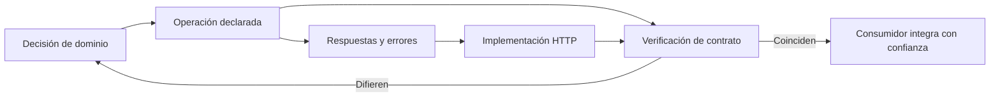

# OpenAPI como contrato vivo

**Estado:** draft

## Introducción

Una especificación escrita después de implementar suele ser un registro
incompleto de lo que alguien cree que existe. Un contrato ejecutable toma el
camino contrario: declara operaciones, entradas, respuestas y errores de modo
que personas y herramientas puedan revisarlos antes de que una divergencia
llegue a producción.

OpenAPI es un formato útil para expresar ese contrato en APIs HTTP. No mejora
una interfaz por sí solo. Su valor aparece cuando la especificación conserva la
semántica del diseño y participa en pruebas, revisión y evolución.

## Concepto

Un contrato ejecutable es una descripción estructurada que puede ser leída por
personas y procesada por herramientas. En OpenAPI, una operación enlaza ruta,
método, parámetros, cuerpo, respuestas, esquemas de datos y requisitos de
seguridad. Ese conjunto crea una superficie verificable entre proveedor y
consumidor.

La especificación no reemplaza decisiones de dominio. Hace visibles las
decisiones que ya deben existir: qué recurso se consulta, qué errores puede
tomar un consumidor, qué campos son obligatorios y qué respuesta acompaña a
cada resultado HTTP.

## Problema

Sin un contrato estructurado, la documentación, los clientes y el servidor
evolucionan por separado. Una ruta puede aceptar una validación nueva sin que
el SDK lo sepa; una respuesta puede cambiar de forma mientras un ejemplo
antiguo sigue circulando; un consumidor puede inventar campos porque no hay
una fuente clara de verdad.

Generar código desde una especificación desactualizada tampoco ayuda. Solo
automatiza la divergencia. El problema no es elegir YAML frente a JSON ni usar
un generador; es mantener una relación explícita entre el contrato publicado,
el comportamiento observado y la revisión humana.

## Alternativas

La primera alternativa es documentar rutas con texto y ejemplos manuales. Es
flexible, pero difícil de validar y propensa a quedar atrás.

La segunda es generar OpenAPI automáticamente desde handlers. Puede ahorrar
escritura, pero el contrato queda subordinado a decisiones de framework y
puede ocultar semántica que el código no modela de forma explícita.

La tercera es diseñar el contrato primero, revisarlo como un artefacto de
ingeniería y comprobar que implementación y ejemplos lo respeten. Este curso
adopta esa alternativa: OpenAPI acompaña al diseño, no sustituye criterio ni
revisión humana.

## Qué debe declarar un contrato

Una operación útil declara intención, método, ruta, entradas, respuestas de
éxito, errores accionables y esquemas con presencia y significado. Cuando hay
paginación, debe describir límite, orden y continuación. Cuando hay
idempotencia o trabajo asíncrono, debe revelar las cabeceras o recursos de
seguimiento que el consumidor necesita.

Los nombres y descripciones importan porque llegan a documentación, SDKs y
revisiones. Sin embargo, una descripción humana no compensa una respuesta sin
esquema o un error sin código estable. El contrato debe mantener ambas capas:
estructura verificable y explicación de intención.

## Invariantes

- Cada operación especificada corresponde a una capacidad observable.
- Cada respuesta declara su código HTTP y forma de datos.
- Los errores públicos comparten códigos y esquemas estables.
- Los campos requeridos y opcionales coinciden con el comportamiento real.
- Un cambio incompatible en OpenAPI sigue las reglas de transición del capítulo
  anterior.
- La generación no publica ni revisa contratos por sí sola.
- La revisión humana decide si la especificación expresa el dominio correcto.

## Preguntas de diseño

1. ¿Qué consumidor puede implementar esta operación solo con el contrato?
2. ¿Qué error o respuesta falta para una decisión observable?
3. ¿El esquema expone una promesa o un detalle interno del proveedor?
4. ¿Cómo detectaríamos una divergencia entre contrato e implementación?
5. ¿Qué cambio del documento requeriría una migración de consumidores?

## Del diseño a la verificación

El contrato vive entre una decisión de diseño y el comportamiento que un
consumidor puede observar. Primero se declara la operación y sus respuestas;
después se implementa el comportamiento; finalmente una comprobación compara
ambas superficies. Si aparece una diferencia, no se corrige a ciegas el YAML o
el handler: se vuelve a decidir qué promesa debe ofrecer la API.



El archivo fuente está en
[`diagrams/05-contratos-ejecutables.mmd`](../diagrams/05-contratos-ejecutables.mmd).
El ciclo termina en la decisión de dominio porque una herramienta puede señalar
la divergencia, pero no decide qué semántica es correcta para el consumidor.

## Implementación

El módulo [`executable_contract`](../src/executable_contract.rs) representa
una `OperationSpec` por identificador, método HTTP, ruta y respuestas
declaradas. Cada `DeclaredResponse` conserva el estado y una descripción que
hace visible su intención.

El constructor rechaza una ruta sin `/`, una operación sin respuestas y estados
HTTP duplicados. No intenta interpretar todo OpenAPI ni generar un servidor:
modela el mínimo que permite preguntar si una operación promete resultados
completos y distinguibles para quien la consume.

## Ejemplo: declarar antes de implementar

```rust
use rust_api_design::executable_contract::{DeclaredResponse, OperationSpec};
use rust_api_design::http::{HttpMethod, HttpStatus};

let operation = OperationSpec::new(
    "getPayment",
    HttpMethod::Get,
    "/payments/{payment_id}",
    vec![
        DeclaredResponse::new(HttpStatus::Ok, "Pago encontrado")?,
        DeclaredResponse::new(HttpStatus::NotFound, "Pago no encontrado")?,
    ],
)?;

assert_eq!(operation.responses().len(), 2);
# Ok::<(), rust_api_design::executable_contract::ContractSpecError>(())
```

El ejemplo ejecutable está en
[`examples/05-contratos-ejecutables.rs`](../examples/05-contratos-ejecutables.rs).
La operación no presupone que toda solicitud termina en éxito: declara el
resultado esperado y el caso que permite al consumidor decidir que el pago no
existe.

## Pruebas

Las pruebas verifican que una operación conserve respuestas de éxito y error,
que no pueda nacer sin respuestas y que no duplique un estado HTTP. No validan
un archivo OpenAPI real contra un servidor; protegen las invariantes que deben
existir antes de integrar ese tipo de herramientas.

## Práctica

Los ejercicios están en
[`docs/ejercicios/05-contratos-ejecutables.md`](ejercicios/05-contratos-ejecutables.md)
y la solución ejecutable en
[`examples/soluciones/05-contratos-ejecutables.rs`](../examples/soluciones/05-contratos-ejecutables.rs).
Antes de consultar la solución, justifica qué decisión permite tomar cada
respuesta y qué divergencia descubriría una prueba de contrato.

## Benchmark

La decisión de benchmark está en
[`benches/05-contratos-ejecutables.md`](../benches/05-contratos-ejecutables.md).
Crear y validar este modelo en memoria no representa el costo de publicar,
verificar o evolucionar una API real; una cifra sintética no mejoraría el
criterio del capítulo.

## Siguiente paso

El siguiente capítulo compara GraphQL y gRPC con el mismo criterio: qué
contrato y qué decisión ofrece cada estilo al consumidor.

## Decisiones registradas

- OpenAPI se enseña como contrato vivo y revisable, no como documentación
  generada al final.
- La automatización verifica consistencia; no reemplaza la decisión humana.
- El capítulo permanece en `draft`; no está revisado ni publicado.
