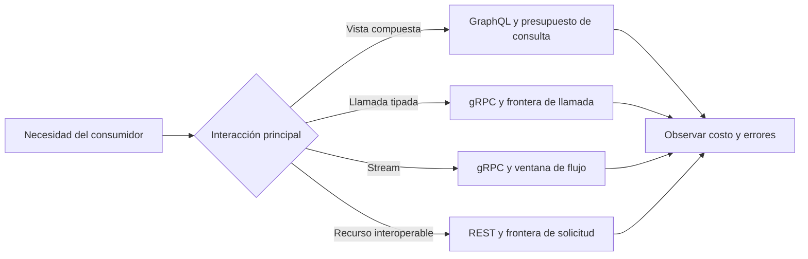

# GraphQL y gRPC

**Estado:** draft

## Introducción

REST no es el único estilo para ofrecer una capacidad de negocio. GraphQL
permite que un consumidor declare la forma de los datos que necesita; gRPC
prioriza contratos tipados y llamadas de bajo costo entre procesos. Ambos
pueden resolver problemas reales, pero también pueden esconder límites,
errores y costos si se adoptan como una preferencia de herramienta.

Este capítulo compara GraphQL y gRPC como contratos para consumidores. No
busca convertir cada API a un estilo nuevo: busca reconocer qué interacción
necesita el sistema, qué promesa puede sostener el proveedor y qué costo
operativo acepta el equipo.

## Concepto

GraphQL expone un grafo tipado que el consumidor consulta declarando campos y
relaciones. Su contrato describe tipos, operaciones y mutaciones; el servidor
resuelve la selección solicitada. Esa flexibilidad puede evitar respuestas con
datos irrelevantes, pero exige controlar profundidad, complejidad, autorización
por campo y el patrón de acceso a datos.

gRPC define servicios y mensajes tipados, normalmente con Protocol Buffers. Su
contrato favorece clientes generados, llamadas entre servicios y streaming
cuando la interacción lo requiere. La eficiencia del transporte no elimina la
necesidad de modelar errores, compatibilidad, límites y observabilidad para
quien integra el servicio.

## Problema

Adoptar GraphQL para reemplazar cualquier colección de endpoints puede crear
consultas costosas o contratos que filtran detalles internos del grafo. Adoptar
gRPC solo por desempeño puede dificultar la integración de navegadores,
proxies o consumidores externos que necesitan interfaces HTTP ampliamente
interoperables.

El error común es comparar sintaxis: rutas frente a queries, JSON frente a
mensajes binarios. La decisión útil compara el trabajo que el consumidor debe
hacer, el control que necesita sobre los datos, la estabilidad del contrato y
la capacidad operativa del proveedor para sostenerlo.

## Alternativas

La primera alternativa es estandarizar un solo estilo para toda interacción.
Simplifica la plataforma al inicio, pero fuerza problemas distintos a compartir
las mismas limitaciones.

La segunda es adoptar GraphQL o gRPC por moda, rendimiento teórico o porque un
equipo ya conoce su ecosistema. Puede producir una implementación rápida sin
una promesa clara para consumidores ni una estrategia de operación.

La tercera es elegir el estilo por la forma de interacción: GraphQL cuando el
consumidor necesita componer vistas desde un grafo controlado; gRPC cuando
servicios con contrato compartido necesitan llamadas tipadas o streaming;
REST cuando el recurso HTTP y su interoperabilidad siguen expresando mejor la
capacidad. Este curso adopta la tercera alternativa.

## Límites de cada contrato

Una consulta GraphQL debe tener límites de profundidad, complejidad y tamaño;
la posibilidad de seleccionar campos no autoriza trabajo ilimitado. Los errores
deben permitir al consumidor entender qué parte de su solicitud falló sin
filtrar detalles internos. Los resolvers también requieren observabilidad para
detectar fan-out, consultas repetidas y dependencias lentas.

Un servicio gRPC debe versionar mensajes de forma compatible, documentar sus
códigos de error y declarar si una llamada puede repetirse. El streaming
necesita límites de duración, cancelación, presión inversa y observabilidad.
Un mensaje tipado no vuelve segura una evolución incompatible ni convierte un
servicio interno en una interfaz adecuada para todo consumidor.

## Invariantes

- El estilo se elige por la interacción y el consumidor, no por preferencia de
  framework.
- Un contrato GraphQL limita la forma y el costo de las consultas observables.
- Un contrato gRPC conserva compatibilidad de mensajes y semántica de errores.
- La autorización se aplica a la capacidad y los datos, no solo a la conexión.
- La generación de clientes acelera integración, pero no decide el diseño.
- Métricas y trazas permiten observar el costo real de resolvers y llamadas.
- Un estilo nuevo no elude las reglas de evolución del capítulo anterior.

## Preguntas de diseño

1. ¿Qué decisión del consumidor requiere componer datos y cuál requiere una
   llamada tipada entre servicios?
2. ¿Qué límite impide que una consulta GraphQL convierta flexibilidad en carga
   impredecible?
3. ¿Qué error o metadato necesita un cliente gRPC para reaccionar sin adivinar?
4. ¿Qué consumidores perderían interoperabilidad si una capacidad dejara HTTP?
5. ¿Cómo detectaríamos una dependencia lenta detrás de un resolver o stream?

## De la interacción al estilo

La decisión empieza con lo que el consumidor necesita resolver, no con el
framework que el proveedor prefiere operar. Una vista que reúne relaciones
puede justificar GraphQL si su costo queda acotado; un flujo entre servicios
puede justificar gRPC si conserva control de presión y cancelación. Si la
capacidad sigue siendo un recurso interoperable, REST puede conservar una
frontera de solicitud explícita.



El archivo fuente está en
[`diagrams/06-estilos-alternativos.mmd`](../diagrams/06-estilos-alternativos.mmd).
El diagrama no convierte la selección en una regla mecánica: obliga a declarar
la interacción y el límite que el proveedor puede sostener.

## Implementación

El módulo [`style_selection`](../src/style_selection.rs) modela una
`StyleSelection` por estilo, interacción y límite de contrato. `ApiStyle`
expresa REST, GraphQL y gRPC; `ConsumerInteraction` expresa la necesidad del
consumidor; `ContractLimit` hace visible el control de costo esperado.

Una vista compuesta con GraphQL exige un `QueryBudget` positivo. Un stream con
gRPC exige una `StreamWindow` con al menos un mensaje en vuelo. El modelo
también rechaza una combinación que no corresponde, como pedir streaming bajo
un estilo REST. No implementa resolvers, Protocol Buffers ni transporte: hace
verificable la decisión que esos componentes deben respetar.

## Ejemplo: límite antes de flexibilidad

```rust
use rust_api_design::style_selection::{
    ApiStyle, ConsumerInteraction, ContractLimit, StyleSelection,
};

let catalog = StyleSelection::new(
    ApiStyle::GraphQl,
    ConsumerInteraction::ComposedView,
    ContractLimit::QueryBudget {
        max_depth: 4,
        max_fields: 40,
    },
)?;

assert_eq!(catalog.style(), ApiStyle::GraphQl);
# Ok::<(), rust_api_design::style_selection::StyleSelectionError>(())
```

El ejemplo ejecutable está en
[`examples/06-estilos-alternativos.rs`](../examples/06-estilos-alternativos.rs).
La vista compuesta no se justifica solo porque el cliente puede pedir campos:
el presupuesto declara que la flexibilidad tiene una frontera operable.

## Pruebas

Las pruebas aceptan una vista GraphQL acotada y un stream gRPC con ventana de
flujo. También rechazan GraphQL sin presupuesto y una interacción que no
corresponde al estilo. No miden rendimiento de un transporte real; protegen el
criterio que debe existir antes de incorporar uno.

## Práctica

Los ejercicios están en
[`docs/ejercicios/06-estilos-alternativos.md`](ejercicios/06-estilos-alternativos.md)
y la solución ejecutable en
[`examples/soluciones/06-estilos-alternativos.rs`](../examples/soluciones/06-estilos-alternativos.rs).
Antes de consultar la solución, justifica qué interacción sostiene el estilo y
qué límite evita que la integración se convierta en una promesa indefinida.

## Benchmark

La decisión de benchmark está en
[`benches/06-estilos-alternativos.md`](../benches/06-estilos-alternativos.md).
El modelo elige contratos en memoria; medirlo no responde una pregunta sobre
latencia de resolvers, serialización o presión de streaming en producción.

## Siguiente paso

El siguiente capítulo estudia cómo operar APIs bajo carga, límites y fallas sin
romper sus contratos.

## Decisiones registradas

- GraphQL y gRPC se enseñan como alternativas condicionadas por la interacción,
  no como reemplazos automáticos de REST.
- Los límites de consulta, compatibilidad y operación son parte del contrato.
- El capítulo permanece en `draft`; no está revisado ni publicado.
