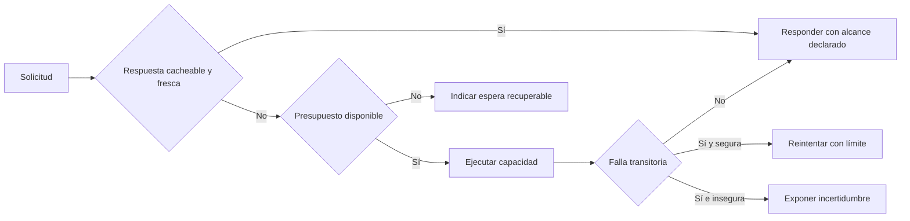

# Caching, rate limiting y resiliencia

**Estado:** draft

## Introducción

Una API no termina cuando el handler devuelve una respuesta correcta en una
prueba local. Bajo carga, una misma capacidad puede entregar datos previos,
rechazar solicitudes, esperar a una dependencia lenta o degradarse. Esos
comportamientos también son parte del contrato: el consumidor necesita saber
qué puede reutilizar, cuándo debe detenerse y qué resultado puede confiar.

Este capítulo estudia caching, rate limiting y resiliencia como promesas
operativas. No son tres interruptores de infraestructura; son decisiones que
protegen recursos compartidos sin convertir la incertidumbre del proveedor en
adivinanzas para el consumidor.

## Concepto

El caching conserva una representación para responder sin repetir trabajo. Su
contrato incluye qué datos pueden compartirse, cuánto tiempo siguen siendo
aceptables y cómo se invalida una versión que ya no representa el estado
necesario. Una respuesta rápida pero obsoleta puede ser útil para un catálogo y
dañina para una autorización o un saldo.

El rate limiting asigna un presupuesto de solicitudes a una identidad, cliente
o capacidad. Cuando el presupuesto se agota, el consumidor necesita una señal
estable que explique que debe esperar o reducir su ritmo; rechazar con un error
genérico oculta una acción recuperable.

La resiliencia reconoce que las dependencias fallan y que una espera infinita
propaga la falla. Timeouts, límites de concurrencia, reintentos seguros,
circuit breakers y resultados degradados acotan el daño. Ninguno convierte un
resultado desconocido en éxito ni autoriza repetir una operación que podría
duplicar efectos.

## Problema

Cachear sin una política explícita puede servir datos de otra persona, ocultar
una modificación crítica o dejar al consumidor sin forma de saber su frescura.
Limitar tráfico sin señales obliga a reintentos agresivos que empeoran la
saturación. Reintentar cualquier error puede duplicar pagos, reservas o
notificaciones precisamente cuando el sistema ya está bajo presión.

Tratar estos mecanismos como detalles internos impide diseñar una experiencia
de recuperación. El consumidor ve una respuesta lenta, una ausencia de datos o
un rechazo, pero no sabe si debe mostrar información previa, esperar, corregir
una solicitud o abandonar una acción que el proveedor quizá ya procesó.

## Alternativas

La primera alternativa es habilitar cache, límites y reintentos con valores por
defecto del framework. Reduce trabajo inicial, pero deja la semántica crítica
implícita y difícil de revisar.

La segunda es priorizar disponibilidad y reintentar o cachear todo. Puede
mejorar métricas superficiales mientras entrega datos incorrectos, multiplica
carga o duplica efectos de negocio.

La tercera es declarar una política por capacidad: frescura y alcance del
cache, presupuesto y señal de recuperación del límite, y reglas de timeout,
reintento o degradación según la semántica de la operación. Este curso adopta
la tercera alternativa.

## Políticas operativas observables

Una política de cache declara al menos la frescura máxima, el alcance de
compartición y la condición que obliga a invalidar. Los datos personales,
permisos y saldos no deben heredar una política compartida solo porque otra
respuesta del mismo endpoint era cacheable.

Una política de límite declara qué se cuenta, cuál es el presupuesto y cómo el
consumidor puede volver a intentarlo. El proveedor puede cambiar la
implementación de contador, pero no debe cambiar sin aviso la semántica de la
señal o convertir un exceso recuperable en una falla indescifrable.

Una política de resiliencia declara el tiempo máximo de espera, qué operaciones
se pueden repetir y cuál es el resultado cuando una dependencia no responde.
Un fallback útil conserva su origen y límites; no presenta una respuesta previa
como si fuera el estado actual ni silencia un resultado parcial.

## Invariantes

- Una respuesta cacheada declara frescura y alcance compatibles con sus datos.
- Un límite agotado ofrece una señal accionable para que el consumidor espere o
  reduzca su ritmo.
- Un timeout acota una espera; no prueba que la operación remota no ocurrió.
- Un reintento automático solo se permite cuando la operación conserva su
  semántica ante repetición.
- Un fallback no se presenta como éxito completo cuando pierde información o
  frescura.
- Los límites de cache, tasa y concurrencia se observan con métricas y trazas.
- Las políticas operativas evolucionan como contrato cuando cambian decisiones
  de consumidores.

## Preguntas de diseño

1. ¿Qué decisión puede tomar un consumidor con datos de hasta cinco minutos y
   cuál requiere el estado actual?
2. ¿Qué identidad comparte el presupuesto de solicitudes y qué señal recibirá
   cuando lo agote?
3. ¿Qué operación puede repetirse sin duplicar un efecto de negocio?
4. ¿Qué resultado degradado seguiría siendo honesto y útil para el consumidor?
5. ¿Qué métrica mostraría que un timeout está protegiendo al sistema o solo
   desplazando la falla?

## De la capacidad a la recuperación

Una misma solicitud puede necesitar responder desde cache, indicar que el
presupuesto se agotó o rechazar un reintento inseguro. La política no elimina
la falla: da al consumidor una respuesta honesta y una acción concreta sin
duplicar trabajo ni efectos de negocio.



El archivo fuente está en
[`diagrams/07-operacion-de-apis.mmd`](../diagrams/07-operacion-de-apis.mmd).
El flujo no sustituye el criterio de negocio: hace visible que la recuperación
depende de la frescura de datos, el presupuesto disponible y la semántica de
repetición.

## Implementación

El módulo [`operation_policy`](../src/operation_policy.rs) representa una
`OperationPolicy` por `CachePolicy`, `RateLimit`, seguridad de la operación y
`RetryRule`. Una política compartida o privada exige frescura positiva;
`RateLimit` conserva el tiempo de espera que permite recuperar la solicitud.

El constructor rechaza reintentos automáticos para una operación no
idempotente. No guarda respuestas, cuenta solicitudes ni detecta fallas
transitorias: modela las condiciones que una implementación de cache, proxy o
cliente debe mantener para no inventar un éxito ni duplicar un efecto.

## Ejemplo: cachear sin repetir efectos

```rust
use rust_api_design::operation_policy::{
    CachePolicy, OperationPolicy, OperationSafety, RateLimit, RetryRule,
};

let catalog = OperationPolicy::new(
    CachePolicy::Shared {
        max_age_seconds: 300,
    },
    RateLimit::new(120, 60, 10)?,
    OperationSafety::ReadOnly,
    RetryRule::OnTransientFailure,
)?;

assert_eq!(catalog.rate_limit().retry_after_seconds(), 10);
# Ok::<(), rust_api_design::operation_policy::OperationPolicyError>(())
```

El ejemplo ejecutable está en
[`examples/07-operacion-de-apis.rs`](../examples/07-operacion-de-apis.rs).
El catálogo puede reutilizar datos durante cinco minutos y repetir una lectura
transitoria; la misma política no autorizaría reintentar una reserva o pago sin
una garantía de idempotencia.

## Pruebas

Las pruebas aceptan una política de catálogo con frescura y espera declaradas.
También rechazan cache sin frescura y reintentos para operaciones no
idempotentes. No prueban una red real; protegen las condiciones previas que
evitan entregar datos engañosos o duplicar efectos bajo presión.

## Práctica

Los ejercicios están en
[`docs/ejercicios/07-operacion-de-apis.md`](ejercicios/07-operacion-de-apis.md)
y la solución ejecutable en
[`examples/soluciones/07-operacion-de-apis.rs`](../examples/soluciones/07-operacion-de-apis.rs).
Antes de consultar la solución, justifica qué señal de recuperación necesita el
consumidor y por qué la operación puede o no puede repetirse automáticamente.

## Benchmark

La decisión de benchmark está en
[`benches/07-operacion-de-apis.md`](../benches/07-operacion-de-apis.md).
El modelo construye una política en memoria; medirlo no respondería una
pregunta de capacidad, latencia o presión que cambie una decisión de producto.

## Siguiente paso

El siguiente capítulo aborda identidad y acceso como fronteras que también
forman parte del contrato de una API.

## Decisiones registradas

- Caching, rate limiting y resiliencia se enseñan como promesas operativas para
  consumidores, no como ajustes invisibles de infraestructura.
- La recuperación honesta conserva frescura, incertidumbre y semántica de
  repetición.
- El capítulo permanece en `draft`; no está revisado ni publicado.
