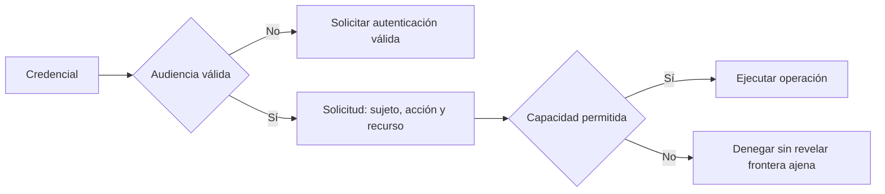

# Autenticación y autorización

**Estado:** draft

## Introducción

Una API que identifica correctamente a una persona todavía puede concederle una
capacidad que no le corresponde. Autenticación responde quién presenta una
credencial; autorización responde si esa identidad puede ejecutar una acción
sobre un recurso concreto. Confundir ambas preguntas convierte permisos en un
efecto incidental de iniciar sesión.

Este capítulo estudia identidad y acceso como fronteras explícitas del
contrato. El objetivo no es recomendar un proveedor de identidad, sino hacer
visible qué evidencia acepta la API, qué capacidad concede y qué información
debe ocultar ante una denegación.

## Concepto

La autenticación vincula una solicitud con una identidad mediante una
credencial verificable y con vigencia limitada. La credencial puede ser una
sesión, token, certificado o mecanismo equivalente; su formato no decide por
sí mismo qué acciones puede realizar quien la presenta.

La autorización evalúa una capacidad contra sujeto, acción, recurso y contexto.
Un rol puede simplificar esa evaluación, pero no sustituye el límite de acceso:
"administrador" no explica automáticamente qué organización, registro o dato
puede modificar. El contrato debe conservar el principio de mínimo privilegio.

## Problema

Confiar en que toda identidad autenticada puede leer o cambiar cualquier dato
crea fugas entre organizaciones y operaciones privilegiadas difíciles de
auditar. Devolver el mismo error para toda denegación también puede ocultar al
consumidor si debe autenticarse, pedir un permiso o corregir el recurso usado.

Exponer demasiada información es el error opuesto: confirmar que un recurso
existe para quien no debe conocerlo revela una frontera interna. La interfaz
necesita señales suficientemente accionables para el consumidor autorizado sin
convertir los mensajes de error en un inventario de datos o permisos.

## Alternativas

La primera alternativa es comprobar solo que existe una sesión. Es fácil de
integrar y deja cada handler inventar sus propios permisos.

La segunda es codificar roles y secretos directamente en cada endpoint. Puede
funcionar al inicio, pero duplica reglas, dificulta revocación y confunde
identidad con capacidad.

La tercera es separar evidencia de identidad y decisión de autorización,
declarar capacidades por recurso y registrar decisiones sensibles. Este curso
adopta la tercera alternativa porque permite revisar, revocar y evolucionar el
acceso sin convertirlo en comportamiento implícito.

## Fronteras observables

Una solicitud sin credencial válida necesita una respuesta que indique que debe
autenticarse. Una identidad válida sin capacidad suficiente necesita una
denegación que no revele datos ajenos. Una operación sensible debe conservar
quién la solicitó, qué decisión se tomó y con qué alcance, sin registrar el
secreto presentado como evidencia.

Las credenciales deben tener audiencia, vigencia y ruta de revocación o
rotación coherentes con el riesgo. Un token de larga duración no compensa una
autorización débil; una regla de permisos detallada no compensa aceptar una
credencial destinada a otro consumidor.

## Invariantes

- Autenticación y autorización son decisiones separadas y observables.
- Toda capacidad se evalúa sobre acción, recurso y contexto necesarios.
- Una identidad recibe solo el privilegio mínimo que su capacidad requiere.
- Una denegación no revela datos ni existencia de recursos fuera de la frontera.
- Las credenciales tienen vigencia y audiencia verificables.
- Secretos y tokens no se registran como parte de la auditoría.
- Los cambios de permisos siguen las reglas de evolución del contrato.

## Preguntas de diseño

1. ¿Qué identidad representa la solicitud y qué evidencia la vincula?
2. ¿Qué acción sobre qué recurso está pidiendo realmente el consumidor?
3. ¿Qué señal necesita una sesión vencida para recuperarse sin revelar secretos?
4. ¿Qué dato no debe aparecer en una denegación entre organizaciones?
5. ¿Qué decisión de acceso necesita auditoría y por cuánto tiempo?

## De la credencial a la capacidad

La autenticación verifica si la credencial sirve para esta API; la autorización
evalúa después la acción sobre el recurso. Separar ambas etapas evita que una
sesión válida se convierta en permiso general y permite denegar sin describir
datos ajenos.



El archivo fuente está en
[`diagrams/08-identidad-y-acceso.mmd`](../diagrams/08-identidad-y-acceso.mmd).
La audiencia verifica el destino de la credencial; no responde todavía si la
identidad puede realizar la acción solicitada.

## Implementación

El módulo [`identity_access`](../src/identity_access.rs) representa una
`Credential` por sujeto y audiencia, una `AccessRequest` por acción y recurso,
y una `AccessDecision` explícita. La función `decide` rechaza una audiencia
distinta y después permite o deniega la capacidad configurada.

El modelo no valida tokens ni guarda permisos en una base de datos. Hace
observable la distinción educativa: una credencial de `ana` para esta API puede
ser válida, pero `ana` solo recibe la acción que la política autoriza.

## Ejemplo: identidad no equivale a permiso

```rust
use rust_api_design::identity_access::{
    decide, AccessDecision, AccessRequest, Action, Credential,
};

let credential = Credential::new("ana", "payments-api")?;
let request = AccessRequest::new(credential, Action::Update, "payment:123")?;

let decision = decide(&request, "payments-api", "ana", Action::Read)?;
assert_eq!(decision, AccessDecision::Denied);
# Ok::<(), rust_api_design::identity_access::AccessError>(())
```

El ejemplo ejecutable está en
[`examples/08-identidad-y-acceso.rs`](../examples/08-identidad-y-acceso.rs).
La denegación no discute la identidad de Ana: muestra que estar autenticada no
concede la capacidad de actualizar ese pago.

## Pruebas

Las pruebas permiten la acción autorizada, deniegan una identidad autenticada
sin la capacidad necesaria y rechazan una credencial destinada a otra
audiencia. No sustituyen políticas reales; protegen las fronteras mínimas que
una integración debe conservar.

## Siguiente paso

El siguiente bloque añadirá práctica, solución ejecutable y una decisión de
benchmark. Después el curso abordará seguridad de APIs y las amenazas que
estas fronteras deben resistir.

## Decisiones registradas

- Identidad y capacidad se enseñan como contratos distintos.
- La autorización protege recursos y contexto, no solo rutas.
- El capítulo permanece en `draft`; no está revisado ni publicado.
