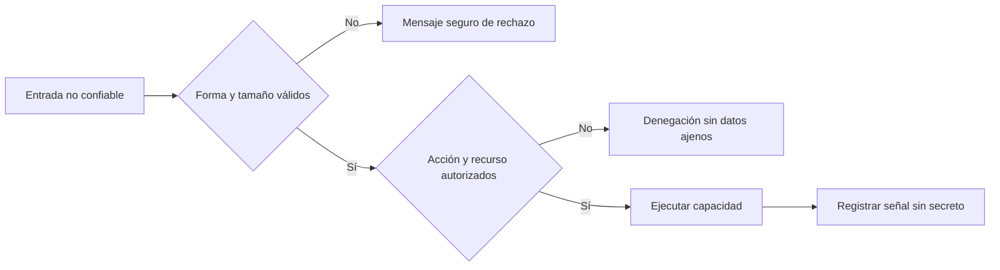

# Seguridad de aplicaciones y OWASP

**Estado:** draft

## Introducción

La seguridad de una API no aparece al final como una lista de cabeceras. Cada
contrato acepta entradas, revela salidas y concede capacidades; por ello cada
decisión de diseño puede ampliar o reducir una frontera de ataque.

Este capítulo estudia amenazas comunes de APIs con el criterio de ingeniería:
identificar el activo, la frontera, el abuso posible y la evidencia que permite
detectarlo. OWASP aporta un lenguaje de riesgos, no un sustituto del análisis
del sistema propio.

## Concepto

Validar entradas confirma forma, tamaño, rango y significado antes de que una
solicitud alcance una operación sensible. Autorizar protege la capacidad y el
recurso, mientras que la exposición controlada evita devolver campos, errores
o metadatos que el consumidor no necesita.

La seguridad también incluye límites contra automatización abusiva, secretos
fuera del código y registros que permitan investigar sin conservar tokens o
datos personales innecesarios. Una defensa útil conserva una decisión
observable: rechazar, limitar, ocultar o alertar por una razón explícita.

## Problema

Confiar en el cliente para validar, ocultar un botón como única autorización o
devolver errores internos convierte detalles de implementación en fronteras
frágiles. Una ruta puede parecer protegida y aun así permitir enumerar
recursos, exceder límites o acceder a datos de otra organización.

Aplicar controles genéricos sin clasificar el riesgo también falla. Un límite
que protege una búsqueda puede bloquear una operación legítima; un log muy
detallado puede crear una nueva fuga; una validación sintáctica no prueba que
la acción tenga sentido para el recurso solicitado.

## Alternativas

La primera alternativa es añadir controles al detectar un incidente. Reacciona
tarde y deja cada capacidad con reglas inconsistentes.

La segunda es copiar una lista de controles sin vincularla a activos ni flujos.
Puede producir muchas configuraciones y poca evidencia de protección real.

La tercera es modelar cada frontera por entrada, autorización, exposición y
abuso, revisar amenazas antes de publicar y registrar señales seguras. Este
curso adopta la tercera alternativa.

## Invariantes

- La validación ocurre del lado del proveedor antes de ejecutar la capacidad.
- La autorización protege acción y recurso, no solo visibilidad de interfaz.
- Las respuestas y errores exponen solo datos necesarios para la decisión.
- Los secretos nunca viajan a logs, ejemplos ni mensajes de error.
- Los límites contra abuso tienen una señal recuperable y son observables.
- Los hallazgos de seguridad se corrigen con evidencia y regresiones cubiertas.

## Preguntas de diseño

1. ¿Qué activo protege esta operación y quién no debe conocerlo?
2. ¿Qué entrada necesita validación estructural y cuál validación de dominio?
3. ¿Qué respuesta permitiría enumerar recursos o permisos ajenos?
4. ¿Qué señal diferenciaría uso legítimo de abuso automatizado?
5. ¿Qué evidencia permite investigar un incidente sin registrar un secreto?

## De la entrada a la frontera

Una frontera segura valida antes de ejecutar y decide qué error puede conocer
el consumidor. Los detalles internos ayudan a depurar al proveedor, pero no
deben viajar junto con datos sensibles ni convertirse en una pista para abuso.



El archivo fuente está en
[`diagrams/09-seguridad-de-apis.mmd`](../diagrams/09-seguridad-de-apis.mmd).
El rechazo es parte del contrato: evita ejecutar datos inválidos y evita usar
un mensaje interno como respuesta para el consumidor.

## Implementación

El módulo [`security_boundary`](../src/security_boundary.rs) representa una
frontera por sensibilidad de entrada y exposición de error. Rechaza valores
vacíos o extensos y prohíbe configurar detalles internos para una entrada
sensible.

No cifra datos ni identifica ataques por sí solo. Hace verificable una regla
previa: una frontera de información sensible solo puede entregar mensajes
seguros a quien consume la API.

## Ejemplo: rechazar sin filtrar

```rust
use rust_api_design::security_boundary::{
    DataSensitivity, ErrorExposure, SecurityBoundary,
};

let boundary = SecurityBoundary::new(
    "importe",
    DataSensitivity::Sensitive,
    ErrorExposure::SafeMessage,
)?;

assert!(boundary.rejects(""));
# Ok::<(), rust_api_design::security_boundary::SecurityError>(())
```

El ejemplo ejecutable está en
[`examples/09-seguridad-de-apis.rs`](../examples/09-seguridad-de-apis.rs).
La entrada se rechaza sin incluir consultas, rutas internas o secretos en la
respuesta.

## Pruebas

Las pruebas aceptan una frontera sensible con mensaje seguro, rechazan detalles
internos y rechazan entradas extensas. No sustituyen un análisis de amenazas;
protegen la condición mínima que evita exponer una frontera interna.

## Práctica

Los ejercicios están en
[`docs/ejercicios/09-seguridad-de-apis.md`](ejercicios/09-seguridad-de-apis.md)
y la solución ejecutable en
[`examples/soluciones/09-seguridad-de-apis.rs`](../examples/soluciones/09-seguridad-de-apis.rs).
Antes de consultar la solución, identifica qué dato sensible protege la
frontera y qué información nunca debe aparecer en el error público.

## Benchmark

La decisión de benchmark está en
[`benches/09-seguridad-de-apis.md`](../benches/09-seguridad-de-apis.md).
El modelo valida reglas pequeñas en memoria; medirlo no decide una amenaza ni
la eficacia de una defensa en producción.

## Siguiente paso

El siguiente capítulo cierra el curso con estrategia de APIs para sistemas
reales.

## Decisiones registradas

- OWASP se usa como lenguaje para razonar riesgos, no como lista mecánica.
- Validación, autorización y exposición forman una misma frontera de seguridad.
- El capítulo permanece en `draft`; no está revisado ni publicado.
