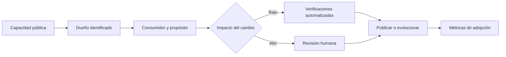

# Estrategia de APIs para sistemas reales

**Estado:** draft

## Introducción

Una API puede tener rutas consistentes y aun así fallar como producto: nadie
sabe quién decide sus cambios, qué consumidores dependen de ella o cuándo una
capacidad dejó de justificar su costo operativo. La estrategia conecta los
contratos locales con propiedad, evolución y resultados de sistema.

## Concepto

El gobierno de APIs define decisiones y responsabilidades que mantienen una
interfaz útil a través de equipos y tiempo. Incluye propiedad explícita,
criterios de diseño, revisión proporcional al riesgo, catálogo de capacidades,
observabilidad de adopción y rutas de retirada. No es un comité que aprueba
rutas: es la disciplina de sostener promesas públicas.

## Problema

Sin propiedad, los contratos se vuelven huérfanos: cada equipo modifica una
parte, nadie responde por compatibilidad y los consumidores descubren cambios
por incidentes. Sin evidencia de uso, se mantienen versiones y endpoints por
costumbre o se retiran capacidades que todavía resuelven trabajo real.

Centralizar toda decisión tampoco resuelve el problema. Puede convertir una
revisión necesaria en espera rutinaria y alejar el criterio del dominio. La
estrategia debe conservar autonomía de equipos junto con fronteras compartidas
que protejan a consumidores y al sistema completo.

## Alternativas

La primera alternativa es dejar cada API sin reglas compartidas. Maximiza la
velocidad local y multiplica inconsistencias, riesgos y costo de integración.

La segunda es imponer un proceso único para cualquier cambio. Da uniformidad
aparente y bloquea decisiones de bajo riesgo sin mejorar las importantes.

La tercera es asignar propiedad, clasificar cambios por impacto, automatizar
verificaciones repetibles y reservar revisión humana para semántica, riesgo y
evolución. Este curso adopta la tercera alternativa.

## Invariantes

- Cada capacidad pública tiene un equipo o responsable identificable.
- Un contrato declara consumidor, propósito y frontera de propiedad.
- Los cambios se revisan según impacto en consumidores, datos y operación.
- La automatización verifica consistencia; no decide semántica ni riesgo.
- Métricas de adopción informan deprecaciones y retiradas.
- Un estándar compartido reduce decisiones repetidas sin ocultar excepciones.

## Preguntas de diseño

1. ¿Quién responde por esta promesa cuando un consumidor reporta una ruptura?
2. ¿Qué evidencia muestra que la capacidad sigue resolviendo trabajo real?
3. ¿Qué cambio requiere revisión de seguridad, operación o compatibilidad?
4. ¿Qué regla puede automatizarse y cuál exige criterio humano?
5. ¿Cómo se retira una capacidad sin abandonar a sus consumidores?

## De la capacidad a la decisión

El gobierno empieza al identificar quién sostiene una capacidad y para quién
existe. Un cambio de bajo impacto puede validarse con reglas repetibles; uno
de alto impacto requiere revisión humana porque modifica una promesa que otros
equipos, datos u operaciones ya pueden estar usando.



El archivo fuente está en
[`diagrams/10-estrategia-gobierno.mmd`](../diagrams/10-estrategia-gobierno.mmd).
La revisión humana no reemplaza la automatización: atiende la semántica y el
riesgo que una comprobación mecánica no puede decidir.

## Implementación

El módulo [`strategy_governance`](../src/strategy_governance.rs) representa
una `ApiCapability` por dueño, consumidor e impacto. El constructor rechaza
capacidades huérfanas y `requires_human_review` deja visible la diferencia
entre cambios de bajo y alto impacto.

El modelo no administra un catálogo ni asigna revisores. Enseña que publicar
una capacidad sin responsable o consumidor explícito vuelve más difícil
evolucionar, medir adopción y reparar una promesa rota.

## Ejemplo: elevar un cambio de alto impacto

```rust
use rust_api_design::strategy_governance::{ApiCapability, ChangeImpact};

let payments = ApiCapability::new("payments", "mobile", ChangeImpact::High)?;

assert!(payments.requires_human_review());
# Ok::<(), rust_api_design::strategy_governance::GovernanceError>(())
```

El ejemplo ejecutable está en
[`examples/10-estrategia-gobierno.rs`](../examples/10-estrategia-gobierno.rs).
El impacto no mide líneas de código: identifica cuándo una promesa pública
necesita una decisión responsable antes de cambiar.

## Pruebas

Las pruebas exigen dueño, distinguen impacto bajo de alto y marcan el segundo
para revisión humana. No sustituyen el juicio del revisor; protegen la
información mínima que permite convocarlo en el momento adecuado.

## Práctica

Los ejercicios están en
[`docs/ejercicios/10-estrategia-gobierno.md`](ejercicios/10-estrategia-gobierno.md)
y la solución ejecutable en
[`examples/soluciones/10-estrategia-gobierno.rs`](../examples/soluciones/10-estrategia-gobierno.rs).
Antes de consultar la solución, explica qué evidencia de adopción necesitarías
antes de retirar la capacidad o cambiar su contrato.

## Benchmark

La decisión de benchmark está en
[`benches/10-estrategia-gobierno.md`](../benches/10-estrategia-gobierno.md).
El modelo construye decisiones en memoria; medirlo no decide propiedad,
impacto ni revisión humana.

## Siguiente paso

El siguiente bloque prepara el cierre editorial del curso.

## Decisiones registradas

- El gobierno se enseña como propiedad y evidencia, no como burocracia.
- La revisión humana se concentra en decisiones semánticas y de riesgo.
- El capítulo permanece en `draft`; no está revisado ni publicado.
